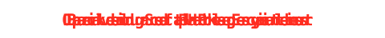
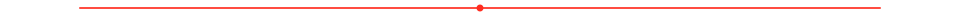
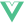
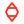
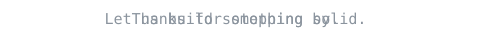
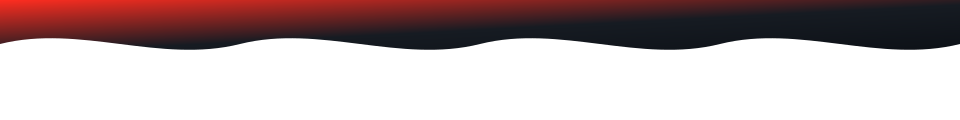

<div align="center">
  
  <br />
  
</div>

<p align="center">
  <a href="https://libinkk.in"></a>
  <a href="https://www.linkedin.com/in/libin-k-k/"></a>
  <a href="mailto:libinkk1999@gmail.com"></a>
  <a href="https://libinkk.in/resume"></a>
  <a href="https://github.com/libin-k-k"></a>
</p>

<p align="center">
  
  
  <a href="https://buymeacoffee.com/libin.k.k"></a>
</p>



##  About Me

I'm a **backend software engineer** from Kanyakumari, Tamil Nadu, with **3+ years** of hands-on experience building Laravel applications, REST APIs, and production-grade PHP packages.

I care about clean architecture, explainable authorization, reusable developer tooling, and systems that stay maintainable after they ship.

- Backend Software Engineer - Laravel, PHP, APIs, and system design
- Experience: **Nexel Infotech** (Jun 2024 - Mar 2026) and **Savior Soft Solutions** (Jan 2023 - May 2024)
- Author of the **Libinkk Laravel stack** on Packagist: Permission, OneAuth, API Starter, Modular
- Focused on authorization engines, authentication infrastructure, modular architecture, and API foundations
- Open to remote and international software engineering roles
- Portfolio, docs, and writing: [libinkk.in](https://libinkk.in) · [Blog](https://libinkk.in/blog)

```php
$libin = [
    'name'     => 'Libin K K',
    'role'     => 'Backend Software Engineer',
    'stack'    => ['Laravel', 'PHP', 'MySQL', 'Redis', 'Docker', 'AWS'],
    'building' => 'Open-source Laravel infrastructure',
    'looking'  => 'Scalable systems and international opportunities',
];
```


##  Currently Building

- [libinkk/permission](https://github.com/libin-k-k/permission) - production-grade Laravel authorization (RBAC + ABAC)
- [libinkk/oneauth](https://github.com/libin-k-k/oneauth) - modular API-first authentication for Laravel 9-13
- [libinkk/modular](https://github.com/libin-k-k/modular) - enterprise modular architecture and code generation
- [libinkk/api-starter](https://github.com/libin-k-k/api-starter) - standardized REST API foundation


##  Tech Stack

<p align="center">
  
  
  
  
  
  
  
  
  
  
  
  
  
  
  
  
  
  
  
  
</p>

**Backend:** PHP · Laravel · REST APIs · Node.js · Composer

**Frontend and apps:** Vue.js · React · Next.js · JavaScript · Flutter · HTML · CSS

**Data, cloud, and workflow:** MySQL · Redis · Docker · AWS · Linux · Git · GitHub Actions · Figma


##  GitHub Analytics

<p align="center">
  
</p>

<p align="center">
  
</p>

<p align="center">
  
</p>


##  Open Source - Libinkk Laravel Stack

Four Composer packages that fit together: **auth**, **authorization**, **API shape**, and **modular architecture**.

```text
Laravel Application
        |
        |-- libinkk/oneauth        Authentication (session, Sanctum, JWT, OTP, 2FA)
        |-- libinkk/permission     Authorization (RBAC, ABAC, tenants, explain)
        |-- libinkk/api-starter    REST API foundation (filters, pagination, errors)
        +-- libinkk/modular        Modules, generators, repository/service workflow
```

###  libinkk/permission

**Production-grade Laravel authorization engine**

RBAC + ABAC, multi-tenancy, hierarchical scopes, temporary access, delegation, explicit allow/deny, audit logging, layered caching, and explainable decisions. Native Gate, Blade, Vue, React, and Filament support.

`composer require libinkk/permission`

[GitHub](https://github.com/libin-k-k/permission) · [Packagist](https://packagist.org/packages/libinkk/permission) · [Docs](https://libinkk.in/permission)

###  libinkk/oneauth

**Modular, API-first authentication for Laravel 9-13**

Session, Sanctum, JWT, OTP, social login, email verification, password policies, 2FA (TOTP / email / SMS), session and device management, account locks, and audit logs - without taking over your User model or UI.

`composer require libinkk/oneauth`

[GitHub](https://github.com/libin-k-k/oneauth) · [Packagist](https://packagist.org/packages/libinkk/oneauth) · [Docs](https://libinkk.in/one-auth)

###  libinkk/modular

**Enterprise modular architecture for Laravel**

Automatic module discovery, CRUD scaffolding, repository and service layers, DTOs, actions, and generators so large Laravel apps stay organized by business module instead of framework folders.

`composer require libinkk/modular`

[GitHub](https://github.com/libin-k-k/modular) · [Packagist](https://packagist.org/packages/libinkk/modular) · [Docs](https://libinkk.in/modular)

###  libinkk/api-starter

**Production-ready Laravel API foundation**

Standardized responses, filtering, sorting, searching, pagination, sparse fields, includes, validation, exception handling, request IDs, error codes, localization, versioning, and Artisan tooling.

`composer require libinkk/api-starter`

[GitHub](https://github.com/libin-k-k/api-starter) · [Packagist](https://packagist.org/packages/libinkk/api-starter) · [Docs](https://libinkk.in/api-starter)

<details>
<summary><strong>More projects</strong></summary>

- [vue-laravel-chat-application-saas](https://github.com/libin-k-k/vue-laravel-chat-application-saas) - Vue + Laravel chat SaaS
- [affiliate-system](https://github.com/libin-k-k/affiliate-system) - multi-level affiliate commissions across a 5-level referral hierarchy
- [student-course-management-node](https://github.com/libin-k-k/student-course-management-node) - student/course management in Node.js
- [laravel-basic-testing](https://github.com/libin-k-k/laravel-basic-testing) - Laravel testing playground
- [portfolio](https://libinkk.in) - personal site and package docs

</details>


##  What I Like Building

```text
Backend Systems
      |
      |-- REST API Architecture
      |-- Authentication and Authorization
      |-- Multi-Tenant SaaS
      |-- Developer Tools
      |-- Laravel Packages
      |-- Database Design
      +-- Scalable Applications
```


##  Experience

**Nexel Infotech** - Software Engineer  
Jun 2024 - Mar 2026  
Backend systems, Laravel, APIs, and production delivery

**Savior Soft Solutions** - Software Engineer  
Jan 2023 - May 2024  
Full-stack Laravel development


##  Activity

<p align="center">
  <picture>
    <source media="(prefers-color-scheme: dark)" srcset="./assets/snake-dark.svg" />
    
  </picture>
</p>


##  Let's Connect

I'm always interested in backend architecture, Laravel packages, and well-built APIs.

<p align="center">
  <a href="https://libinkk.in"></a>
  <a href="https://www.linkedin.com/in/libin-k-k/"></a>
  <a href="mailto:libinkk1999@gmail.com"></a>
  <a href="https://instagram.com/libin_k.k"></a>
  <a href="https://buymeacoffee.com/libin.k.k"></a>
</p>

<p align="center">
  
</p>


